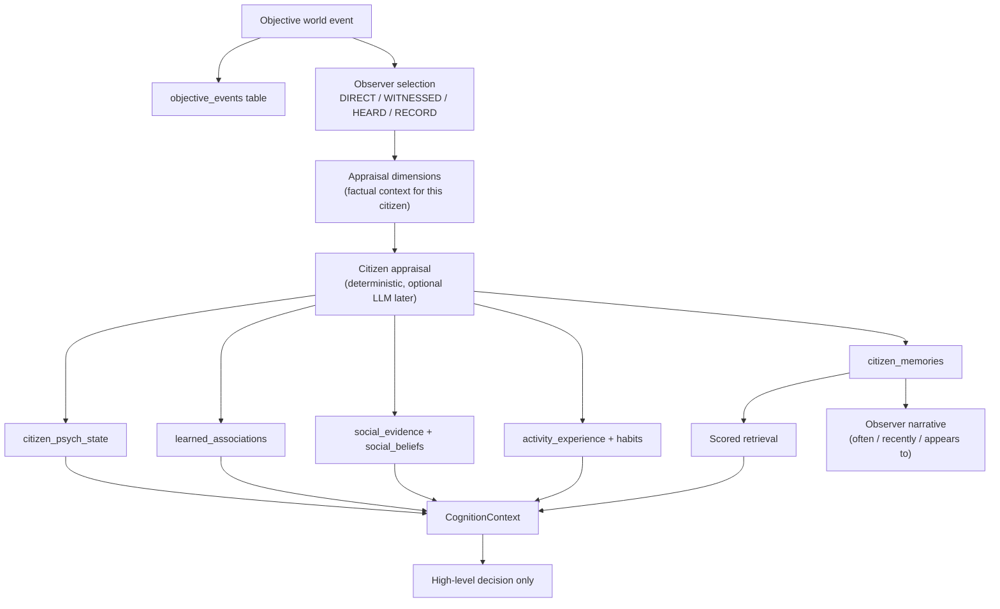

# Cognitive foundation

World events are **objective**. Citizens interpret them **subjectively**.

This layer gives persistent people individual histories. It does not assign Atlas = brave or Maya = kind. Personality is an observer inference from memories, choices, successes, failures, relationships, associations, habits, and expressed beliefs.

```
TRUE IMMEDIATE SURVIVAL REFLEX
        ↓
HIGH-LEVEL CITIZEN DECISION   ← memory / psychology inform this layer only
        ↓
DETERMINISTIC TASK PLANNING
        ↓
VERIFIED MINECRAFT SKILLS
```

This package must not steer block-level movement.

## Packages

| Package | Role |
| --- | --- |
| `@civ/memory` | Typed memories, objective event log, SQLite cognitive store, retrieval, embeddings interface |
| `@civ/psychology` | Appraisal, affect, associations, habits, local social beliefs, cognition context, narrative |

Live AgentManager still uses the legacy `createMemory` / `retrieveRelevant` helpers. Wiring `CitizenMind` happens after the stabilization branch merges.

## Architecture



## Objective facts vs interpretation

Example engine record:

- giver = Maya
- receiver = Atlas
- item = bread
- count = 3
- Atlas hunger = 4

Atlas may remember: `Maya gave me 3 bread when I was very hungry.`

The pipeline does **not** automatically store:

- Maya is good
- trust +25
- Atlas loves Maya

It stores evidence and bounded deltas. Local social beliefs are per-observer. There is no global reputation score.

Rumors use source `HEARD` and a lower confidence. They never insert into `objective_events`.

## Memory types

| Type | Meaning |
| --- | --- |
| Immediate | Short-lived routine experience |
| Episodic | Durable personal episode with structured appraisal |
| Semantic | Consolidated fact / summary |
| Social | Claim or relationship-centered memory (rumors, heard reports) |
| Association | Link from a subject (creeper, place, activity) to danger/safety/success |

Episodic fields include provenance, participants, objective facts, structured `subjectiveAppraisal`, salience, importance, tags, recall metadata. No hidden chain-of-thought.

## Appraisal

Input: objective event, observer needs, current mood, relevant memories, relationship evidence, learned associations.

Output (schema-validated, bounded):

- memory importance / salience
- mood, stress, fear, anger, sadness, positive affect, confidence deltas (each clamped to ±0.2)
- association proposals
- optional social evidence interpretation
- a short citizen-facing summary

These values are **simulation state**, not diagnoses. Use low mood, fear, stress, sadness, withdrawal, confidence. Do not label depression or anxiety disorders.

## Local social knowledge

`SocialBelief` is `observer → target`. Atlas's view of Maya is not Theo's view of Maya.

Evidence kinds include help, attack, gift, rumor, witnessed act, death. Familiarity can rise from contact. Trust/affection/respect/resentment are **evidence accumulators**, not a single reputation number applied to everyone.

## Emergent personality

No `riskTolerance = 0.73` at citizen creation.

`BehaviorProfile` is calculated from history for observers:

- often takes risks
- has tended to persist after failures
- recently avoids creepers

Those phrases are not injected into the model as `YOU ARE A BRAVE PERSON`.

## Habits and activity

Repeated action in a similar context can form a habit (`stress_high|settlement_safe` + `farm`). Strength is learnable and reversible. Nothing hard-codes sadness → potatoes.

Activity experience tracks attempts, successes, failures, recent success rate, familiarity, and confidence. Kai can become familiar with mining without being labeled a miner.

## Learned associations

Associations strengthen, weaken, get contradicted, and decay. A creeper destroying storage can raise `creeper → danger`. Later harmless encounters can reduce that strength. They are never frozen at 1.

## Salience and consolidation

Routine wood chopping is aggregated. Exceptional episodes (death, attack, rescue while starving, storage loss) stay durable.

After enough similar low-importance work, consolidation can emit:

`Spent much of the day gathering wood successfully.`

plus higher `gather_wood` familiarity.

## Retrieval and embeddings

Retrieval scores recency, importance, participants, goal text, location, and associations. Default limit is 8.

`EmbeddingProvider`:

- `NoopEmbeddingProvider` — tests and default
- `OllamaEmbeddingProvider` — optional `nomic-embed-text`

Insertion never waits on embeddings. SQLite can store vectors later; basic tests do not require them.

## Cognition context

`CognitionContext` is the intended replacement for dumping health, hunger, inventory, and a few strings into the model. This branch also adds `CognitionService`, `ModelRouter`, and `CognitionContextBuilder` in `@civ/cognition` (see [COGNITION.md](./COGNITION.md)). They are not wired into AgentManager yet.

## Deep reflection

`ReflectionTrigger` / `ReflectionContext` / `ReflectionResult` exist so rare events (close death, betrayal, major loss) can later route to a heavier model. This branch detects triggers and does not call one.

## Death

Permanent death runtime lifecycle is owned by another branch. This layer only:

- records the objective death
- writes witness / participant memories
- marks the cognitive identity deceased
- **does not delete** memories or psych state

Distant citizens do not magically know. They can be told later via `CitizenMind.hear`.

## Query API

```ts
const mind = new CitizenMind(new CognitiveStore(dbPath));
mind.ingest(event, snapshot);
mind.hear({ observerId, informantId, claim, aboutCitizenId });
mind.whatDoesCitizenRemember("citizen_atlas");
mind.whatDoesCitizenBelieveAbout("citizen_atlas", "citizen_theo");
mind.snapshot("citizen_atlas"); // activities, associations, narrative, profile
mind.retrieve({ citizenId: "citizen_atlas", query: "creeper", nearbyEntities: ["creeper"] });
mind.context({ citizenId: "citizen_atlas", currentGoal: "gather_wood", snapshot });
```

## Integration after merge

Do not wire this into files currently owned by stabilization work:

- `packages/agent-core/src/manager.ts`
- `packages/agent-core/src/store.ts`
- `packages/cognition/src/ollama.ts` / `schema.ts`
- minecraft-adapter pathing / death runtime
- skills gather / movement
- society chat
- dashboard event formatting

Later:

```ts
const cognitive = attachCognitiveStore(civilizationStore.db);
const mind = new CitizenMind(cognitive);
const adapted = fromSimEvent(simEvent);
if (adapted) mind.ingest(adapted, snapshot);
```

Deceased citizens in `civilization.sqlite` stay in that table; cognitive identities are a parallel, restrict-on-delete history.

## Out of scope

Government, elections, taxes, religion, children, reproduction, immigration, markets, war, courts, inheritance, full economy.
